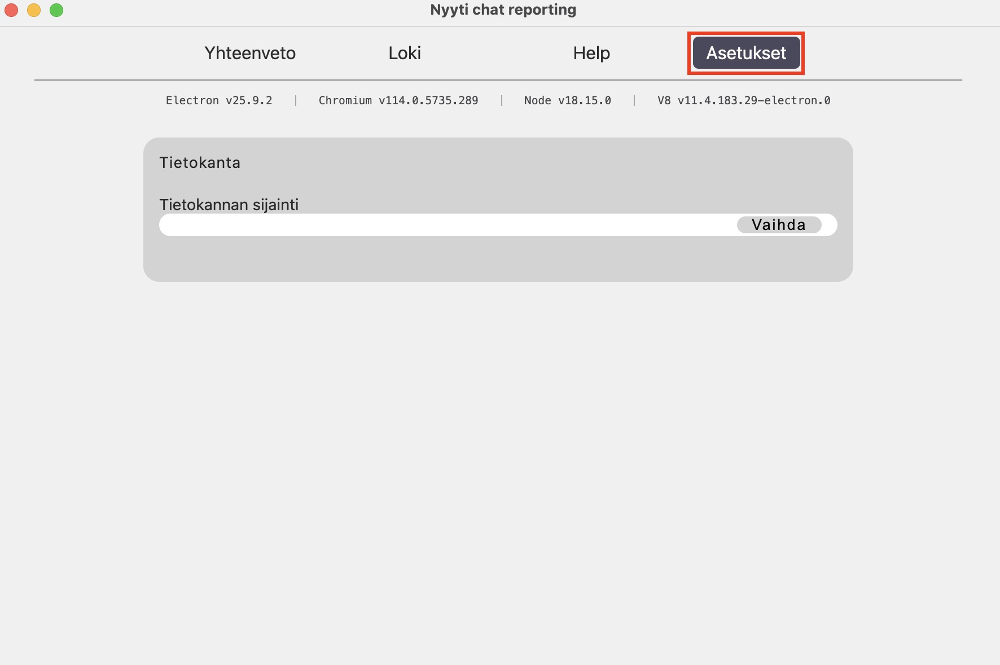

# Dokumentaatio

## Ohjelman asentaminen

### Mac

Sovelluksen käynnistäminen ja uuden tietokanta tiedoston luominen, jos tietokanta tiedosto on jo olemassa voit mennä vaiheeseen [sovelluksen käyttöönotto](#sovelluksen-käyttöönotto)

#### Tietokannan luominen

1. Avaa TextEdit sovellus
   
2. Avaa ylhäältä "Format" välilehti ja paina "Make plain text" tai vaihtoehtoisesti voit käyttää näppäin yhdistelmää ⇧ + ⌘ + T
   
3. Kun tiedosto on plain text muodossa se voidaan tallentaa oikeaan muotoon valitsemalla file -> save... tai ⌘ + S
   
4. seuraavaksi annetaan tiedostolle nimi, joka voi olla ihan mikä vain, mutta tärkeintä on että se päättyy .db
   
5. valmista tietokanta on nyt luotu

#### Sovelluksen käyttöönotto

1. Käynnistä sovellus painamalla kahdesti kuvakkeesta
   
2. Kun sovellus on käynnistynyt mene asetukset välilehdelle
   
3. Paina vaihda nappia, joka avaa finder näkymän
   
4. Etsi ja valitse oikea tietokanta, finder ei anna valita muita kuin .db päätteisiä tiedostoja
   
5. paina avaa nappia
   
6. sovellus saattaa kysyä lupaa kyseisen kansion tiedostoihin, tässä kohtaa voi painaa ok
   
7. voit varmistaa mikä tietokanta on käytössä asetukset välilehdeltä
   
8. Sovellus on nyt valmis käytettäväksi

### Windows

Sovelluksen käynnistäminen ja uuden tietokanta tiedoston luominen, jos tietokanta tiedosto on jo olemassa voit mennä vaiheeseen [sovelluksen käyttöönotto](#sovelluksen-käyttöönotto-windows)

#### Tietokannan luominen

1. Paina hiiren oikeen painiketta
   
2. Valitse uusi text document
   
3. Avaa tiedosto painamalla sitä kaksi kertaa
   
4. Tallenna tiedosto File -> save as tai painamalla crtl+shift+s
   
5. Anna tietokannalle nimi joka päättyy .db
   
6. Vaihda tiedoston tyyppi tekstityypistä kaikkiin tyyppeihin.
   
7. Tallenna tiedosto
   
8. Valmista tietokanta on nyt luotu

#### Sovelluksen käyttöönotto windows

1. Avaa sovellus painamalla kahdesti kuvakkeesta
   
2. Kun sovellus on käynnistynyt mene asetukset välilehdelle
   
3. Paina vaihda nappia, joka avaa resurssien hallinta ikkunan
   
4. Etsi ja valitse oikea tietokanta, resurssien hallinta ei anna valita muita kuin .db päätteisiä tiedostoja
   
5. Paina avaa nappia
   
6. Voit varmistaa mikä tietokanta on käytössä asetukset välilehdeltä
   
7. Sovellus on nyt valmis käytettäväksi

## Palautteiden hakeminen Ninchatistä

1. Mene loki-välilehdelle
   
2. Paina aloita nappia
   
3. Anna käyttäjätunnuksesi ja paina seuraava
   
4. Tarkista että tiedot vaikuttavat oikealta
   
5. Odota että ruutuun ilmestyy valmis teksti, jonka jälkeen voit sulkea sivun.
   

## Palautteiden lajitteleminen

### Aikavälillä

1. aloitus päivä valitaan painamalla "Start date" nappia, joka avaa kalenteri näkymän
   
2. kalenteri näkymästä valitaan aloitus päivä
   
    - siniset ympyrät näyttävät päivät, jolloin on tehty palautteita
    - kalenterissä pystyy liikkumaan nuolien avulla tai painamalla kuukaudesta tai vuodesta
3. aloitus päivän jälkeen valitaan aikavälin viimeinen päivä
   
4. kun aikaväli on asetettu painetaan etsi nappia
   
5. sen jälkeen näkyvissä on vain aikaväliin kuuluvat palautteet
   

## Palautteiden tulkitseminen

### Alkupalautteet

1. Alkupalautteista nähdään fiilikset, ikä haarukka, sekä sukupuoli jakauma
   
2. Sen alapuolella on viivakaaviossa fiilikset viikoittain
   

### Loppupalautteet

1. monivalinta loppupalauteet
   
2. monivalintojen jälkeen tulee näkyviin avoin loppupalaute
   
3. avoimet loppupalautteet löytyvät kysymysten alta, ja ne voi avata painamalla plus (+) nappia
   
4. kysymyksen saa kiinni painamalla miinus (-) nappia
   
